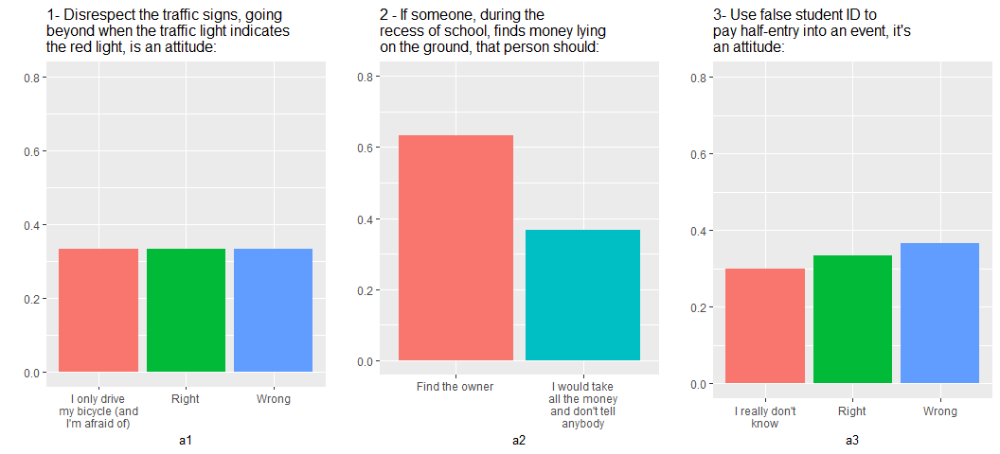

breaker
=======

This package contains functions to work with different break line options. For now, I only wrote a function: `nbreak()`.

### nbreak

The `nbreak()` function can be very useful when you want to break lines of a string recursively, or just break a once.

### Instalation

``` r
devtools::install_github("igorkf/breaker")
library(breaker)
```

### Settings

We're setting `fig.width` only to show wider plots in this document.

``` r
knitr::opts_chunk$set(fig.width = 11)
library(tidyverse)
```

### Usage

``` r
nbreak(string = "I want to break lines until the end of this sentence, every 3 words", n = 3) %>% cat()
#> I want to
#> break lines until
#> the end of
#> this sentence, every
#> 3 words
nbreak(string = "I don't like to jump too much!", n = 3, loop = F) %>% cat()
#> I don't like
#> to jump too much!
```

The function simply adds `\n` among the words:

``` r
nbreak(string = "I want to break lines until the end of this sentence, every 3 words", n = 3)
#> [1] "I want to\nbreak lines until\nthe end of\nthis sentence, every\n3 words"
```

If your word is not a multiple from the `n` argument, there's no problem. The function will run until the end of the sentence. Note that `loop = TRUE` by default.

### An example

``` r
tibble(a1 = sample(c("I don't know", "Right", "Wrong"), size = 30, replace = T, prob = c(0.4, 0.3, 0.3))) %>% 
  ggplot(aes(x = a1, fill = a1)) +
    geom_bar(aes(y = (..count..)/sum(..count..))) +
    coord_cartesian(ylim = c(0, 0.5)) +
    ylab("") +
    labs(title = "Thats a title!") +
    theme(legend.position = "none",
          title = element_text(size = 10))
```

 That's seems good, right? But if you wanted to do it for a lot of plots that have big texts?

------------------------------------------------------------------------

We'll use these answers of a questionary:

``` r
#This package allows you to stick multiple charts side by side:
#install.packages("cowplot")

titles <- c("1- Disrespect the traffic signs, going beyond when the traffic light indicates the red light, is an attitude:",
            "2 - If someone, during the recess of school, finds money lying on the ground, that person should:",
            "3- Use false student ID to pay half-entry into an event, it's an attitude:")

tab <- tibble(a1 = sample(c("I only drive my bicycle (and I'm afraid of)", "Right", "Wrong"), size = 30,
                          replace = T, prob = c(0.4, 0.3, 0.3)),
              a2 = sample(c("Find the owner", "I would take all the money and don't tell anybody"), size = 30,
                          replace = T, prob = c(0.7, 0.3)),
              a3 = sample(c("Wrong", "Right", "I really don't know"), size = 30,
                          replace = T, prob = c(0.3, 0.3, 0.4)))

ans <- tab %>% colnames()

#ans is getting into x and titles into y:
map2(ans, titles,
    ~ggplot(tab, aes(x = !!sym(.x), fill = !!sym(.x))) +
        geom_bar(aes(y = (..count..)/sum(..count..))) +
        coord_cartesian(ylim = c(0, 0.8)) +
        ylab("") +
        labs(title = .y) +
        theme(legend.position = "none",
              title = element_text(size = 10))) %>% 
cowplot::plot_grid(plotlist = ., ncol = 3)
```

 Look up this mess!

We can make a function (just to be easier to put in map2) and fix it up:

``` r
gg <- function(data, x, y){
data %>%
  mutate_all(. %>% map_chr(., ~nbreak(.x, n = 3))) %>% 
  as.data.frame() %>% 
  ggplot(aes(x = !!sym(x), fill = !!sym(x))) +
    geom_bar(aes(y = (..count..)/sum(..count..))) +
    coord_cartesian(ylim = c(0, 0.8)) +
    ylab("") +
    labs(title = nbreak(string = y, n = 6)) +
    theme(legend.position = "none",
          title = element_text(size = 10))
}

map2(ans, titles, ~gg(tab, .x, .y)) %>% 
  cowplot::plot_grid(plotlist = ., ncol = 3)
```



Feel free to improve!
